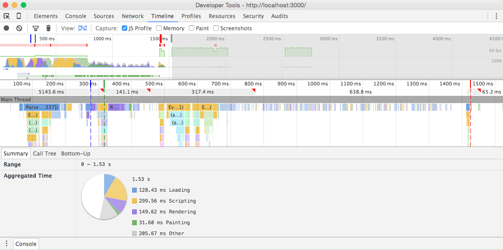
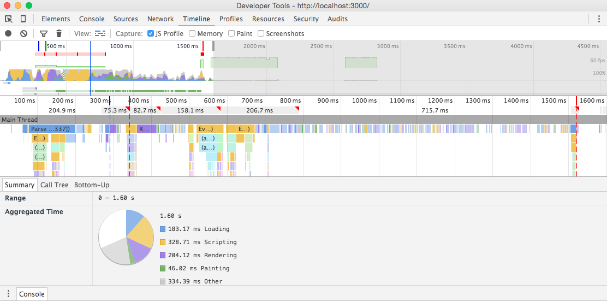
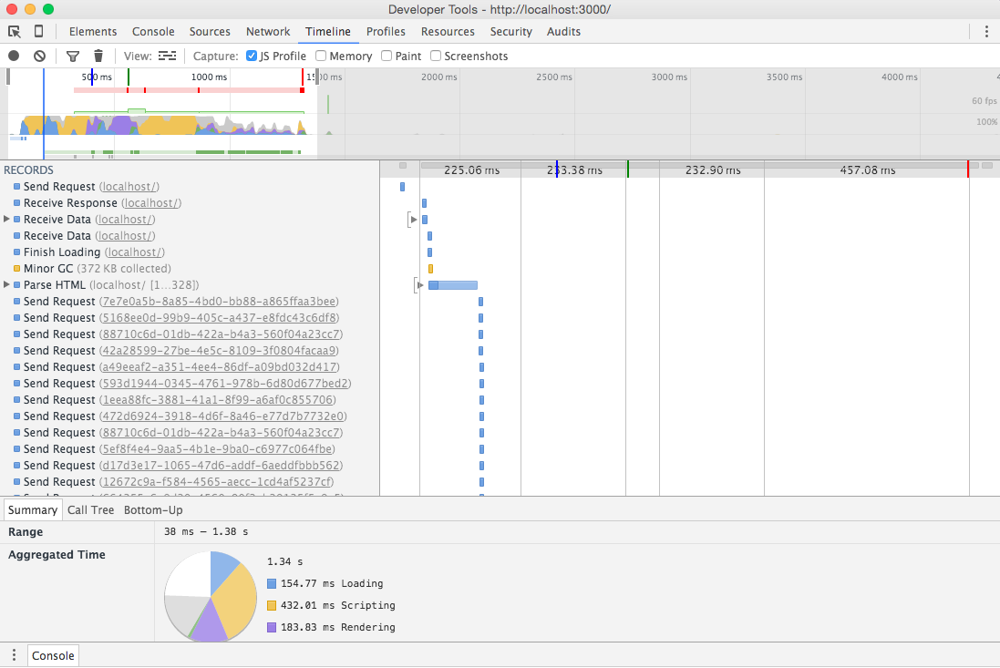
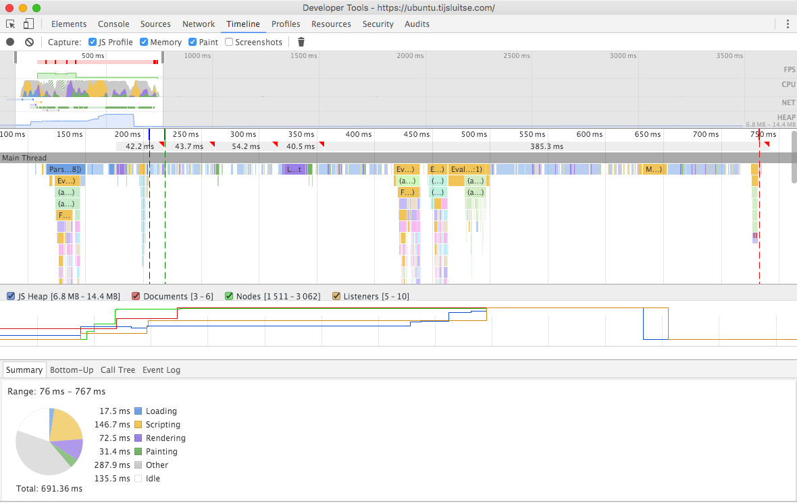

#Gulp or Grunt?

There are two main differences between Grunt and Gulp
- Grunt focuses on configuration, while Gulp focuses on code
- Grunt was built around a set of built-in, and commonly used tasks, while Gulp came around with the idea of enforcing nothing, but how community-developed micro-tasks should connect to each other

Compared to in-memory operations, disk writes are slow which means that Gulp has a big speed advantage (for now). A speed comparison was done by tech.tmw which shows that most tasks are at least twice as fast on Gulp. While this wasn’t a hugely scientific study the tendency is there and I’ve seen the same with my own projects. But how big of an impact is the difference in speed?

The argument goes like this: Gulp is a good example that code over configuration can be a good thing when configuration gets a bit confusing. Other people say that while this is true and Gulp is easier to read, it is more difficult to write because piping can be a bit confusing.

I have chosen to use Gulp, not only because I am a beginner and want to use a "simple" taskmanager, but also because the support I can get at my classmates. 

Source: [Hongkiat](http://www.hongkiat.com/blog/gulp-vs-grunt/)

#HTTP Requests
The amount of http request at the start of this final exercise was: 170. Now there are 165 http requests, so we won 5 requests! 

To reduce this amount I have created a sprite SVG for all icons, I have minified the CSS and JS files and optimized all images. Besides that I have created a fontface observer to check if the font is loaded.

##Sprite SVG
- DOMLoadedContent: 344ms
- First Paint: 407ms
- Loadevent: 1.10s

##Minified CSS & JS 
- DOMLoadedContent: 277ms
- First Paint: 317ms
- Loadevent: 1.43s

##Compress images
- DOMLoadedContent: 291ms
- First Paint: 343ms
- Loadevent: 1.52s

##Webfonts
- DOMLoadedContent: 401ms
- First Paint: 559ms
- Loadevent: 1.32s

#Conclusion
The latest results are great. When I now reload my page the results show that because of all the performance improvements, we lost seconds in loading time! Here are the final results:

##First paint:
- DOMContentLoaded: 1.53s
- First paint: 1.62s
- Load event: 15.01s

##Last paint with performance updates:
- DOMLoadedContent: 219ms
- First Paint: 244ms
- Loadevent: 873ms

##Seconds won:
- DOMLoadedContent: 1.31s faster
- First Paint: 1.37s faster
- Loadevent: 14.1s faster

It's amazing what updating your performance can do. So be aware of this in all your future projects. 

