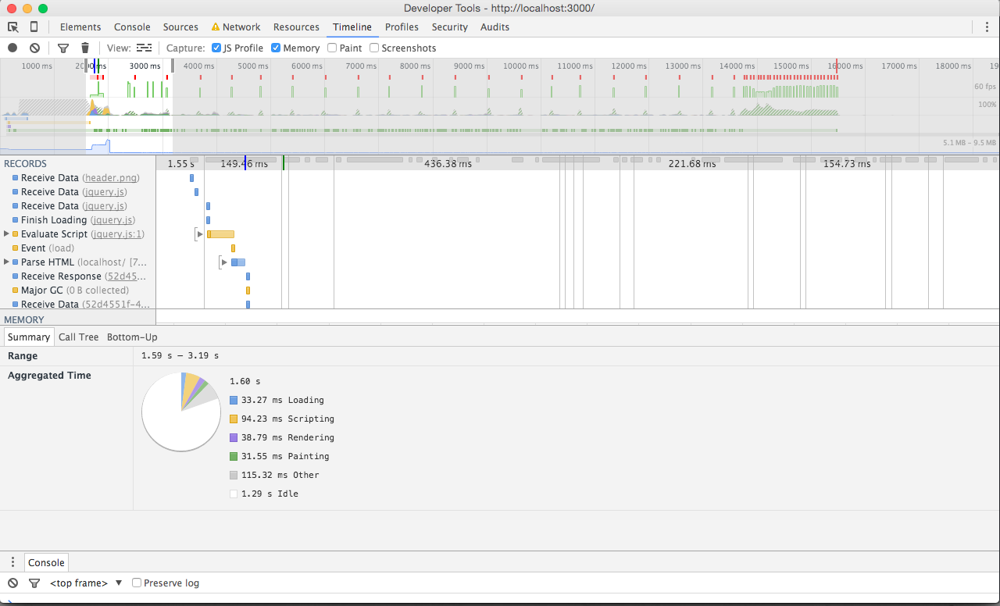
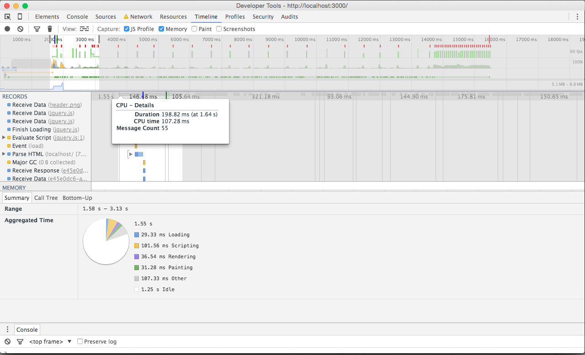
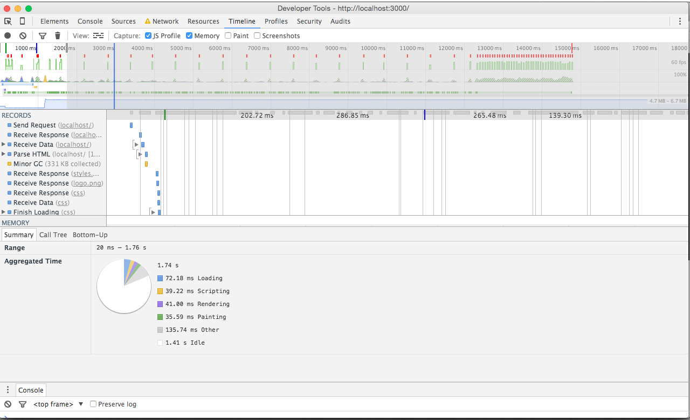
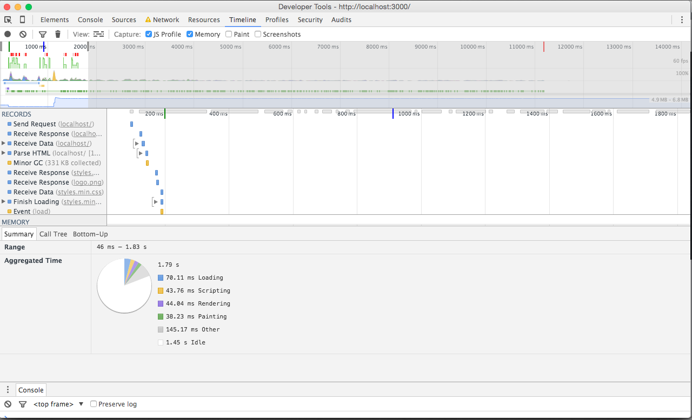
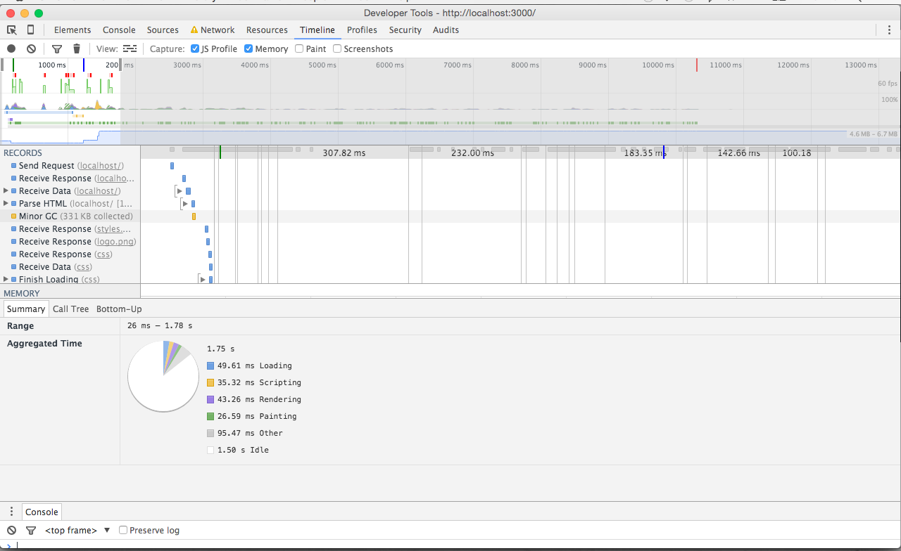

# LookLive server

The project you're looking at is an [express.js](http://expressjs.com) project. You'll use it to get set up a development environment where you're
going to optimize the way this project works. In it's current state, the css is messy, the rendering isn't modern and
overall the product is boring and not efficient. It's up to you to fix this and improve it.

## Getting started

### Step 1 - clone the repo
Github provides some instructions for this and we're assuming that you know how to clone this repo. If you're not sure,
don't hesitate to raise your hand now and ask.

### Step 2 - install dependencies
In order to run the server you'll need to install express.js and it's dependencies. In order to do this, open up a 
terminal and navigate to your project folder (for example `cd ~/Projects/looklive-server`). When you've done this, type
this command to run the instal:

```
npm install
```

That should get you setup.

### Step 3 - running the server
To run the server, stay at the 'root' of your project folder and type:

```
npm start
```

That will get the server to run on port 3000. If you go to [http://localhost:3000](http://localhost:3000) in your browser
you should see an overview page.

## The api

This project comes with a simple API. All you need to know for now is that there's three endpoints:

* `/api/feed/` <- returns a feed of appearances
* `/api/appearance/:uuid` <- returns a single appearance, more detailed than in the feed. Replace `:uuid` with the 
appearance id.
* `/api/product/:uuid` <- returns a single product, including similar and bargain products. Replace `:uuid` with the 
product id.

The API returns JSON (for now).

##Exercises - Improving the loading of the Looklive server

###First state of application
- DOMContentLoaded: 1.53s
- First paint: 1.62s
- Load event: 15.01s


##Optimized the HTML & CSS 

###Before
- DOMContentLoaded: 1.53s
- First paint: 1.62s
- Load event: 15.01s

###After 
- DOMContentLoaded: 1.57s
- First paint: 1.66s
- Load event: 15.03s



##Icons from .png to .svg 

###Before 
- DOMContentLoaded: 1.57s
- First paint: 1.66s
- Load event: 15.03s

###After 
- DOMContentLoaded: 1.70s
- First paint: 1.75s
- Load event: 15.4s



##Used Vanilla JS instead of JQuery

###Before 
- DOMContentLoaded: 1.70s
- First paint: 1.75s
- Load event: 15.4s

###After 
- DOMContentLoaded: 953ms
- First paint: 165ms
- Load event: 14.4s



##Changed header image (from .png to web optimized .jpg)

###Before 
- DOMContentLoaded: 953ms
- First paint: 165ms
- Load event: 14.4s

###After 
- DOMContentLoaded: 899ms
- First paint: 158ms
- Load event: 10.48s



##Build one page application

###Before 
- DOMContentLoaded: 899ms
- First paint: 158ms
- Load event: 10.48s

###After 
- DOMContentLoaded: 1.03s
- First paint: 167ms
- Load event: 10.18s



##Conclusion

After doing all the adjustments can be seen that the application has definitely become faster. But because the testing has been done in an environment having a non-constant internet connection, the results are different each time I refresh the page. Finally I can say that in the DOMContentLoaded, the first paint and the load event won some time. And time is very precious. 

###First time
- DOMContentLoaded: 1.53s
- First paint: 1.62s
- Load event: 15.01s

###After improvements
- DOMContentLoaded: 1.03s
- First paint: 167ms
- Load event: 10.18s


