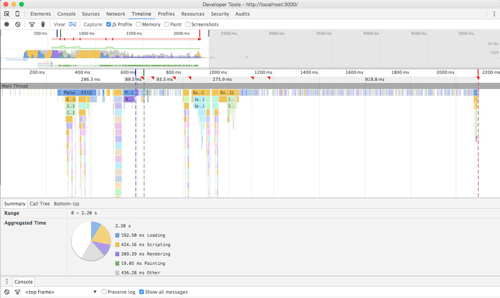
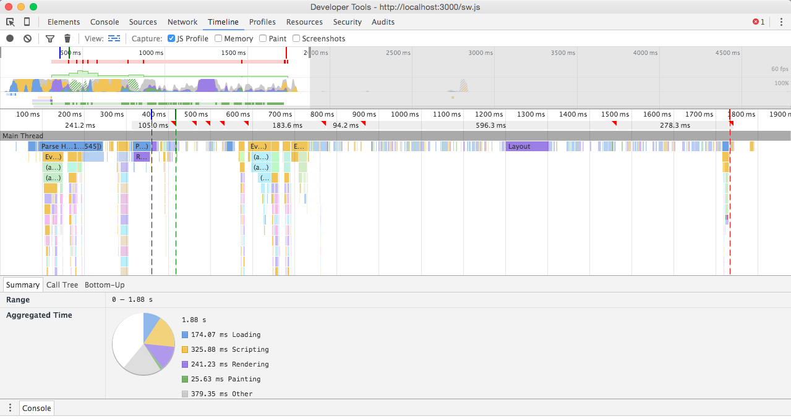

#Exercises

###Functionalities
- Don't render everything in JS - async render
- Inline first css styles
- Improve first render when in mean time api request is done
- Using cache - Service worker
- Streaming API 
- Read offline button for users

##Before & After Service worker Caching

###Before
- DomContentLoad: 593ms
- Firstpaint: 630ms
- Load event: 2.10s

###After 
- DomContentLoad: 360ms
- Firstpaint: 418ms
- Load event: 1.73s 

##What is a progressive web app?
"A Progressive Web App uses modern web capabilities to deliver an app-like user experience. They evolve from pages in browser tabs to immersive, top-level apps, leveraging the web's low friction."

- Progressive - Work for every user, regardless of browser choice because they’re built with progressive enhancement as a core tenet.
- Responsive - Fit any form factor: desktop, mobile, tablet, or whatever is next.
- Connectivity independent - Enhanced with service workers to work offline or on low quality networks.
- App-like - Feel like an app to the user with app-style interactions and navigation because it's built on the app shell model.
- Fresh - Always up-to-date thanks to the service worker update process.
- Safe - Served via HTTPS to prevent snooping and ensure content hasn’t been tampered with.
- Discoverable - Are identifiable as “applications” thanks to W3C manifests and service worker registration scope allowing search engines to find them.
- Re-engageable - Make re-engagement easy through features like push notifications.
- Installable - Allow users to “keep” apps they find most useful on their home screen without the hassle of an app store.
- Linkable - Easily share via URL and not require complex installation.

Tijs: "What means that a progressive web application behaves and feels like an app, but uses modern browser technologies. Think of one page apps with geolocation, localstorage or caching. With progressive enhanchement you can create very nice user experiences, always responsible. For modern browsers it's easy but always think minimal first, create everything PE. So that every usercase has a fallback." 

Source: [Google Developers](https://developers.google.com/web/progressive-web-apps)

##Install Looklive on a online server

Link: [Looklive - Tijs Luitse](https://ubuntu.tijsluitse.com)

